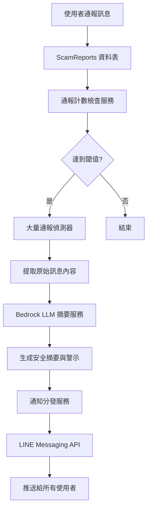
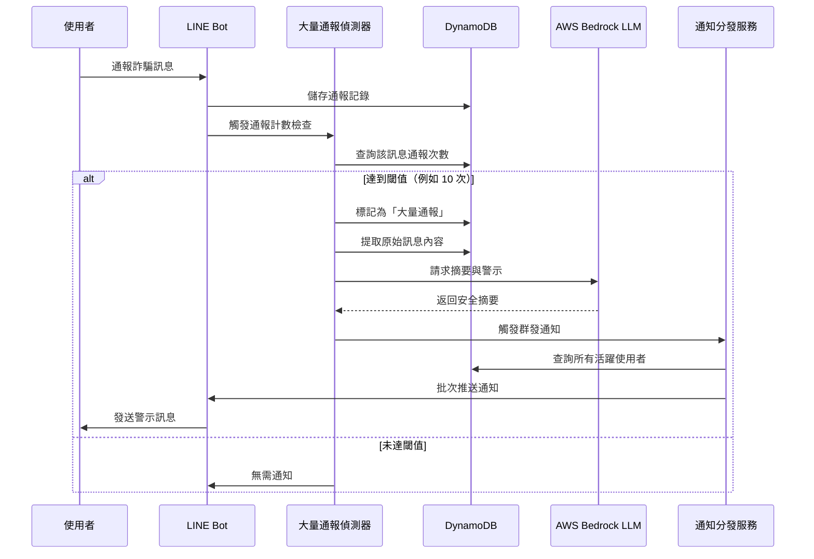

# 設計文件：大量通報訊息通知系統

## 概述

當資料庫中某則訊息收到大量使用者通報時，系統將主動向所有使用者發送通知。為保護使用者隱私與安全，系統不會直接推送原始訊息內容，而是透過 AWS Bedrock LLM 服務對該訊息進行摘要與風險示警，然後將處理後的安全內容推送給所有使用者。

此功能旨在建立社群防詐預警機制，讓使用者能即時獲知當前流行的詐騙手法，提升整體防詐意識。

本設計整合現有的 `bedrock_service.py`（LLM 分析）、`database.py`（資料庫操作）與 `main.py`（LINE Bot 訊息推送）模組。

## 架構設計



## 序列圖

### 主要流程：大量通報偵測與通知




## 元件與介面

### 元件 1：MassReportDetector（大量通報偵測器）

**目的**：監控訊息通報次數，當達到閾值時觸發通知流程

**介面**：
```python
class MassReportDetector:
    def check_report_threshold(self, normalized_url: str) -> bool:
        """檢查 URL 通報次數是否達到閾值"""
        pass
    
    def mark_as_mass_reported(self, normalized_url: str) -> bool:
        """標記 URL 為大量通報狀態"""
        pass
    
    def get_original_message(self, normalized_url: str) -> str:
        """提取原始訊息內容"""
        pass
```

**職責**：
- 查詢 ScamReports 資料表統計特定 URL 的通報次數
- 判斷是否達到大量通報閾值（預設 10 次）
- 標記已處理的大量通報，避免重複通知
- 提取原始訊息內容供 LLM 分析

### 元件 2：BedrockSummarizer（Bedrock 摘要服務）

**目的**：使用 AWS Bedrock LLM 對大量通報訊息進行摘要與警示生成

**介面**：
```python
class BedrockSummarizer:
    def generate_mass_report_alert(self, original_message: str, report_count: int) -> dict:
        """生成大量通報警示摘要"""
        pass
```

**職責**：
- 接收原始詐騙訊息內容
- 呼叫 Bedrock LLM API 生成安全摘要
- 生成風險警示與防範建議
- 返回結構化的警示內容（不包含原始訊息）

### 元件 3：NotificationDispatcher（通知分發服務）

**目的**：將警示訊息批次推送給所有使用者

**介面**：
```python
class NotificationDispatcher:
    def broadcast_mass_report_alert(self, alert_message: str) -> dict:
        """廣播大量通報警示給所有使用者"""
        pass
    
    def get_all_active_users(self) -> List[str]:
        """取得所有活躍使用者的 LINE UID"""
        pass
    
    def send_push_message(self, user_ids: List[str], message: str) -> dict:
        """批次推送訊息"""
        pass
```

**職責**：
- 查詢所有活躍使用者（曾使用過系統的使用者）
- 使用 LINE Messaging API 的 Push Message 功能批次推送
- 處理推送失敗的錯誤（例如使用者封鎖 Bot）
- 記錄推送結果與統計

## 資料模型

### 模型 1：MassReportAlert（大量通報警示記錄）

```python
class MassReportAlert(BaseModel):
    """大量通報警示記錄"""
    alert_id: str  # 警示 ID（UUID）
    normalized_url: str  # 正規化 URL
    report_count: int  # 通報次數
    alert_summary: str  # LLM 生成的摘要
    alert_warning: str  # 警示訊息
    notified_user_count: int  # 已通知使用者數量
    created_at: datetime  # 建立時間
    status: str  # 狀態：pending, processing, completed, failed
```

**驗證規則**：
- `alert_id` 必須為有效的 UUID 格式
- `report_count` 必須 >= 閾值（預設 10）
- `alert_summary` 不可包含原始訊息內容
- `status` 必須為預定義的狀態值之一

### 模型 2：擴充現有 ScamReport 模型

```python
class ScamReport(BaseModel):
    # ... 現有欄位 ...
    is_mass_reported: bool = False  # 是否已標記為大量通報
    mass_report_alert_id: Optional[str] = None  # 關聯的警示 ID
```

**驗證規則**：
- `is_mass_reported` 為 True 時，`mass_report_alert_id` 不可為空
- 同一 `normalized_url` 只能關聯一個 `mass_report_alert_id`


## 關鍵函式與形式化規格

### 函式 1：check_report_threshold()

```python
def check_report_threshold(normalized_url: str, threshold: int = 10) -> bool:
    """檢查 URL 通報次數是否達到閾值"""
    pass
```

**前置條件（Preconditions）**：
- `normalized_url` 為非空字串且格式有效
- `threshold` 為正整數（> 0）
- ScamReports 資料表可存取

**後置條件（Postconditions）**：
- 返回布林值
- 當且僅當該 URL 的通報次數 >= `threshold` 時返回 `True`
- 不修改資料庫狀態（唯讀操作）

**迴圈不變式（Loop Invariants）**：N/A（無迴圈）

### 函式 2：generate_mass_report_alert()

```python
def generate_mass_report_alert(original_message: str, report_count: int) -> dict:
    """使用 Bedrock LLM 生成大量通報警示"""
    pass
```

**前置條件（Preconditions）**：
- `original_message` 為非空字串
- `report_count` >= 10（已達閾值）
- AWS Bedrock 服務可用且憑證有效

**後置條件（Postconditions）**：
- 返回包含 `alert_summary` 和 `alert_warning` 的字典
- `alert_summary` 不包含原始訊息的完整內容
- `alert_warning` 包含具體的防範建議
- 若 LLM 呼叫失敗，返回預設的安全警示訊息

**迴圈不變式（Loop Invariants）**：N/A（無迴圈）

### 函式 3：broadcast_mass_report_alert()

```python
def broadcast_mass_report_alert(alert_message: str, user_ids: List[str]) -> dict:
    """批次推送警示訊息給使用者"""
    pass
```

**前置條件（Preconditions）**：
- `alert_message` 為非空字串且長度 <= 5000 字元（LINE 限制）
- `user_ids` 為非空列表
- 所有 `user_id` 格式有效（以 'U' 開頭）
- LINE Messaging API 可用且 access token 有效

**後置條件（Postconditions）**：
- 返回包含 `success_count` 和 `failed_count` 的字典
- `success_count` + `failed_count` = len(user_ids)
- 所有成功推送的使用者都收到訊息
- 失敗的推送記錄在日誌中

**迴圈不變式（Loop Invariants）**：
- 對於每個已處理的 user_id，其推送結果已記錄
- `success_count` + `failed_count` = 已處理的 user_id 數量

## 演算法虛擬碼

### 主要處理演算法：處理大量通報流程

```python
# Algorithm: Process Mass Report Detection and Notification
# Input: normalized_url (string), current_report_count (integer)
# Output: notification_result (dict)

def process_mass_report(normalized_url: str, current_report_count: int) -> dict:
    """
    處理大量通報偵測與通知流程
    
    Preconditions:
    - normalized_url is valid and non-empty
    - current_report_count >= 0
    - Database and external services are accessible
    
    Postconditions:
    - If threshold reached: notification sent to all users
    - Mass report status updated in database
    - Returns result with success status and notification count
    """
    
    # Step 1: 檢查是否達到閾值
    THRESHOLD = 10
    
    if current_report_count < THRESHOLD:
        return {"triggered": False, "reason": "threshold_not_reached"}
    
    # Step 2: 檢查是否已處理過（避免重複通知）
    existing_alert = query_mass_report_alert(normalized_url)
    
    if existing_alert is not None:
        return {"triggered": False, "reason": "already_notified"}
    
    # Step 3: 提取原始訊息內容
    original_message = get_original_message_from_reports(normalized_url)
    
    if original_message is None or len(original_message) == 0:
        return {"triggered": False, "reason": "no_message_content"}
    
    # Step 4: 呼叫 Bedrock LLM 生成摘要與警示
    try:
        llm_result = generate_mass_report_alert(original_message, current_report_count)
        alert_summary = llm_result["alert_summary"]
        alert_warning = llm_result["alert_warning"]
    except Exception as e:
        # 使用預設警示訊息
        alert_summary = "系統偵測到大量使用者通報相同詐騙訊息"
        alert_warning = "請提高警覺，避免點擊可疑連結或提供個人資訊"
    
    # Step 5: 建立警示記錄
    alert_id = generate_uuid()
    alert_record = {
        "alert_id": alert_id,
        "normalized_url": normalized_url,
        "report_count": current_report_count,
        "alert_summary": alert_summary,
        "alert_warning": alert_warning,
        "status": "processing",
        "created_at": current_timestamp()
    }
    
    save_mass_report_alert(alert_record)
    
    # Step 6: 標記所有相關通報為「已處理」
    mark_reports_as_mass_reported(normalized_url, alert_id)
    
    # Step 7: 取得所有活躍使用者
    active_users = get_all_active_users()
    
    # Step 8: 格式化通知訊息
    notification_message = format_mass_report_notification(
        alert_summary, 
        alert_warning, 
        current_report_count
    )
    
    # Step 9: 批次推送通知
    push_result = broadcast_mass_report_alert(notification_message, active_users)
    
    # Step 10: 更新警示記錄狀態
    update_alert_status(
        alert_id=alert_id,
        status="completed",
        notified_user_count=push_result["success_count"]
    )
    
    return {
        "triggered": True,
        "alert_id": alert_id,
        "notified_users": push_result["success_count"],
        "failed_users": push_result["failed_count"]
    }
```

**前置條件**：
- `normalized_url` 為有效的正規化 URL
- `current_report_count` 為非負整數
- 資料庫與外部服務（Bedrock、LINE API）可存取

**後置條件**：
- 若達到閾值且未曾通知，則所有活躍使用者收到通知
- 大量通報狀態已更新至資料庫
- 返回包含觸發狀態與通知統計的結果

**迴圈不變式**：N/A（主流程無迴圈，迴圈在子函式中）


### 驗證演算法：檢查通報閾值

```python
# Algorithm: Check Report Threshold
# Input: normalized_url (string), threshold (integer)
# Output: is_threshold_reached (boolean)

def check_report_threshold(normalized_url: str, threshold: int = 10) -> bool:
    """
    檢查 URL 通報次數是否達到閾值
    
    Preconditions:
    - normalized_url is non-empty string
    - threshold > 0
    - ScamReports table is accessible
    
    Postconditions:
    - Returns boolean value
    - True if and only if report count >= threshold
    - No database state changes (read-only operation)
    """
    
    # Step 1: 查詢該 URL 的所有通報記錄
    reports = query_reports_by_url(normalized_url)
    
    # Step 2: 計算通報次數
    report_count = len(reports)
    
    # Step 3: 比較是否達到閾值
    if report_count >= threshold:
        return True
    else:
        return False
```

**前置條件**：
- `normalized_url` 為非空字串
- `threshold` 為正整數
- ScamReports 資料表可存取

**後置條件**：
- 返回布林值，表示是否達到閾值
- 不修改任何資料庫狀態

**迴圈不變式**：N/A（無迴圈）

### 批次推送演算法

```python
# Algorithm: Broadcast Mass Report Alert
# Input: alert_message (string), user_ids (list of strings)
# Output: result (dict with success_count and failed_count)

def broadcast_mass_report_alert(alert_message: str, user_ids: List[str]) -> dict:
    """
    批次推送警示訊息給使用者
    
    Preconditions:
    - alert_message is non-empty and length <= 5000
    - user_ids is non-empty list
    - All user_ids are valid LINE UIDs
    - LINE Messaging API is accessible
    
    Postconditions:
    - Returns dict with success_count and failed_count
    - success_count + failed_count = len(user_ids)
    - All successful pushes delivered to users
    - Failed pushes logged
    
    Loop Invariants:
    - For each processed user_id, push result is recorded
    - success_count + failed_count = number of processed user_ids
    """
    
    success_count = 0
    failed_count = 0
    failed_users = []
    
    # LINE API 批次推送限制：每次最多 500 個使用者
    BATCH_SIZE = 500
    
    # 分批處理使用者列表
    for i in range(0, len(user_ids), BATCH_SIZE):
        # Loop Invariant: success_count + failed_count = i
        
        batch = user_ids[i:i + BATCH_SIZE]
        
        try:
            # 呼叫 LINE Messaging API 批次推送
            push_result = line_bot_api.multicast(
                to=batch,
                messages=[TextMessage(text=alert_message)]
            )
            
            # 假設批次推送成功
            success_count += len(batch)
            
        except LineBotApiError as e:
            # 批次推送失敗，記錄錯誤
            print(f"Batch push failed: {e}")
            failed_count += len(batch)
            failed_users.extend(batch)
            
            # 可選：對失敗的批次進行單一推送重試
            for user_id in batch:
                try:
                    line_bot_api.push_message(
                        to=user_id,
                        messages=[TextMessage(text=alert_message)]
                    )
                    success_count += 1
                    failed_count -= 1
                    failed_users.remove(user_id)
                except Exception as retry_error:
                    print(f"Retry failed for user {user_id}: {retry_error}")
    
    # 記錄推送結果
    log_push_result(
        success_count=success_count,
        failed_count=failed_count,
        failed_users=failed_users
    )
    
    return {
        "success_count": success_count,
        "failed_count": failed_count,
        "failed_users": failed_users
    }
```

**前置條件**：
- `alert_message` 為非空字串且長度 <= 5000
- `user_ids` 為非空列表
- 所有 user_id 格式有效
- LINE Messaging API 可用

**後置條件**：
- 返回包含成功與失敗計數的字典
- 成功計數 + 失敗計數 = 使用者總數
- 所有成功推送的使用者都收到訊息

**迴圈不變式**：
- 對於每個已處理的 user_id，其推送結果已記錄
- `success_count` + `failed_count` = 已處理的 user_id 數量

## 使用範例

### 範例 1：基本使用流程

```python
# 當使用者通報詐騙訊息時，檢查是否觸發大量通報
normalized_url = "http://scam-site.com/fake-investment"
current_report_count = 10  # 剛好達到閾值

# 處理大量通報
result = process_mass_report(normalized_url, current_report_count)

if result["triggered"]:
    print(f"✅ 大量通報警示已發送給 {result['notified_users']} 位使用者")
    print(f"警示 ID: {result['alert_id']}")
else:
    print(f"ℹ️ 未觸發通知：{result['reason']}")
```

### 範例 2：整合到現有的通報流程

```python
# 在 main.py 的 handle_text() 函式中整合
def handle_text(event):
    user_text = event.message.text
    user_id = event.source.user_id
    
    # 偵測網址
    urls = re.findall(r'https?://[^\s]+', user_text)
    
    if urls:
        # 使用 Bedrock 分析詐騙風險
        analysis_result = analyze_scam_content(user_text)
        
        # 儲存通報記錄
        record = ScamDetectionRecord(...)
        add_detection_record(record)
        
        # 更新團隊積分
        team_result = update_team_points_for_report(...)
        
        # 【新增】檢查是否觸發大量通報
        normalized_url = normalize_url(urls[0])
        current_count = get_report_count(normalized_url)
        
        mass_report_result = process_mass_report(normalized_url, current_count)
        
        if mass_report_result["triggered"]:
            print(f"🚨 觸發大量通報警示！已通知 {mass_report_result['notified_users']} 位使用者")
        
        # 回覆使用者
        reply_message(event.reply_token, format_reply_message(analysis_result))
```

### 範例 3：完整的通知訊息格式

```python
def format_mass_report_notification(alert_summary: str, alert_warning: str, report_count: int) -> str:
    """格式化大量通報通知訊息"""
    
    message = f"""🚨 社群防詐警示

📊 系統偵測到大量通報
已有 {report_count} 位使用者通報相同詐騙訊息

⚠️ 風險摘要：
{alert_summary}

💡 防範建議：
{alert_warning}

🛡️ 請提高警覺，保護自己與親友的財產安全！

📱 如收到類似訊息，請立即通報給我們。
"""
    
    return message
```


## 正確性屬性

### 屬性 1：閾值檢查正確性

**陳述**：對於任意正規化 URL，當且僅當其通報次數 >= 閾值時，`check_report_threshold()` 返回 `True`

**形式化表示**：
```
∀ url ∈ ValidURLs, threshold ∈ ℕ⁺:
  check_report_threshold(url, threshold) = True 
  ⟺ 
  count(reports where normalized_url = url) >= threshold
```

**測試策略**：
- 單元測試：測試邊界值（閾值 - 1、閾值、閾值 + 1）
- 屬性測試：使用 Hypothesis 生成隨機 URL 與閾值，驗證計數邏輯

### 屬性 2：通知唯一性

**陳述**：對於同一個正規化 URL，系統最多只發送一次大量通報警示

**形式化表示**：
```
∀ url ∈ ValidURLs:
  count(MassReportAlerts where normalized_url = url) <= 1
```

**測試策略**：
- 整合測試：模擬多次達到閾值的情況，驗證只通知一次
- 並發測試：使用多執行緒同時觸發，驗證資料庫鎖定機制

### 屬性 3：訊息安全性

**陳述**：所有推送給使用者的警示訊息不包含原始詐騙訊息的完整內容

**形式化表示**：
```
∀ alert ∈ MassReportAlerts, original_msg ∈ OriginalMessages:
  alert.normalized_url = original_msg.normalized_url
  ⟹
  alert.alert_summary ≠ original_msg.content ∧
  similarity(alert.alert_summary, original_msg.content) < 0.8
```

**測試策略**：
- 單元測試：驗證 LLM 輸出不包含原始訊息
- 相似度測試：使用文字相似度演算法（如 Levenshtein distance）確保摘要與原文差異足夠大

### 屬性 4：推送完整性

**陳述**：批次推送的成功計數與失敗計數之和等於目標使用者總數

**形式化表示**：
```
∀ user_ids ∈ List[UserID], result ∈ PushResult:
  result = broadcast_mass_report_alert(msg, user_ids)
  ⟹
  result.success_count + result.failed_count = len(user_ids)
```

**測試策略**：
- 單元測試：模擬部分推送失敗的情況
- 屬性測試：使用 Hypothesis 生成不同大小的使用者列表

### 屬性 5：冪等性

**陳述**：對於已標記為「大量通報」的 URL，重複呼叫 `process_mass_report()` 不會產生新的通知

**形式化表示**：
```
∀ url ∈ ValidURLs:
  process_mass_report(url, count) = {triggered: True, ...}
  ⟹
  process_mass_report(url, count') = {triggered: False, reason: "already_notified"}
  (for any count' >= threshold)
```

**測試策略**：
- 整合測試：連續呼叫兩次，驗證第二次返回 `already_notified`
- 資料庫測試：驗證 `is_mass_reported` 標記正確設定

## 錯誤處理

### 錯誤場景 1：Bedrock LLM 服務不可用

**條件**：AWS Bedrock API 呼叫失敗（網路錯誤、配額超限、服務中斷）

**回應**：
- 捕獲異常，記錄錯誤日誌
- 使用預設的安全警示訊息（不包含原始內容）
- 繼續執行通知流程，不中斷

**復原**：
- 預設訊息範例：「系統偵測到大量使用者通報相同詐騙訊息，請提高警覺」
- 後續可手動重新生成摘要（可選）

### 錯誤場景 2：LINE Messaging API 推送失敗

**條件**：批次推送失敗（使用者封鎖 Bot、帳號無效、API 限流）

**回應**：
- 對失敗的批次進行單一推送重試
- 記錄失敗的使用者 ID 與錯誤原因
- 更新警示記錄的 `notified_user_count` 為實際成功數量

**復原**：
- 失敗的使用者不影響其他使用者接收通知
- 可選：建立重試佇列，稍後再次嘗試

### 錯誤場景 3：資料庫查詢失敗

**條件**：DynamoDB 查詢超時或連線錯誤

**回應**：
- 捕獲異常，記錄錯誤日誌
- 返回 `{triggered: False, reason: "database_error"}`
- 不執行通知流程，避免資料不一致

**復原**：
- 等待資料庫服務恢復
- 可選：實作重試機制（指數退避）

### 錯誤場景 4：並發競爭條件

**條件**：多個請求同時達到閾值，可能產生重複通知

**回應**：
- 使用資料庫條件寫入（Conditional Put）確保唯一性
- 檢查 `is_mass_reported` 標記，若已存在則跳過

**復原**：
- DynamoDB 的條件寫入會自動拒絕重複寫入
- 第二個請求會收到 `already_notified` 回應

## 測試策略

### 單元測試方法

**測試範圍**：
- `MassReportDetector.check_report_threshold()` - 閾值檢查邏輯
- `BedrockSummarizer.generate_mass_report_alert()` - LLM 摘要生成
- `NotificationDispatcher.broadcast_mass_report_alert()` - 批次推送邏輯

**關鍵測試案例**：
1. 通報次數邊界值測試（9, 10, 11 次）
2. LLM 回應解析測試（正常回應、異常回應、空回應）
3. 批次推送測試（空列表、單一使用者、大量使用者）
4. 錯誤處理測試（API 失敗、網路超時）

**覆蓋率目標**：> 90%

### 屬性測試方法

**測試框架**：Hypothesis（Python）

**屬性測試案例**：
1. **閾值檢查屬性**：對於任意 URL 與閾值，計數邏輯正確
2. **推送完整性屬性**：成功數 + 失敗數 = 總數
3. **冪等性屬性**：重複呼叫不產生新通知
4. **訊息安全性屬性**：摘要不包含原始內容

**範例**：
```python
from hypothesis import given, strategies as st

@given(
    url=st.text(min_size=10, max_size=100),
    report_count=st.integers(min_value=0, max_value=100),
    threshold=st.integers(min_value=1, max_value=20)
)
def test_threshold_check_property(url, report_count, threshold):
    """屬性測試：閾值檢查邏輯正確性"""
    # 模擬資料庫回傳 report_count 筆記錄
    mock_reports = [{"normalized_url": url}] * report_count
    
    result = check_report_threshold(url, threshold)
    
    # 驗證屬性：當且僅當 report_count >= threshold 時返回 True
    assert result == (report_count >= threshold)
```

### 整合測試方法

**測試範圍**：
- 完整的大量通報流程（從通報到推送）
- 資料庫與外部服務的整合
- 並發情況下的行為

**關鍵測試案例**：
1. 端到端流程測試：模擬 10 次通報，驗證觸發通知
2. 重複通知防護測試：驗證同一 URL 只通知一次
3. 並發測試：多執行緒同時達到閾值
4. 外部服務失敗測試：模擬 Bedrock/LINE API 失敗


## 效能考量

### 考量 1：資料庫查詢效能

**挑戰**：查詢特定 URL 的通報次數需要掃描 ScamReports 表

**解決方案**：
- 使用 `NormalizedUrlIndex` GSI（Global Secondary Index）加速查詢
- 索引結構：Partition Key = `normalized_url`
- 查詢複雜度：O(1) 而非 O(n)

**預期效能**：
- 單次查詢延遲：< 50ms
- 支援每秒 1000+ 次查詢

### 考量 2：批次推送效能

**挑戰**：推送給所有使用者可能需要較長時間（假設 10,000 位使用者）

**解決方案**：
- 使用 LINE Messaging API 的 Multicast 功能（每次最多 500 位使用者）
- 分批處理：10,000 / 500 = 20 批次
- 非同步處理：使用背景任務（Celery 或 AWS Lambda）

**預期效能**：
- 單批次推送延遲：< 2 秒
- 總推送時間（10,000 使用者）：< 1 分鐘

### 考量 3：LLM 呼叫延遲

**挑戰**：Bedrock LLM 呼叫可能需要 2-5 秒

**解決方案**：
- 非同步處理：不阻塞主要通報流程
- 快取機制：相同訊息內容的摘要可快取（可選）
- 超時設定：設定 10 秒超時，失敗時使用預設訊息

**預期效能**：
- LLM 呼叫延遲：2-5 秒（正常）
- 超時後降級：< 100ms（使用預設訊息）

### 考量 4：並發處理

**挑戰**：多個使用者同時通報可能產生競爭條件

**解決方案**：
- 使用 DynamoDB 條件寫入（Conditional Put）確保原子性
- 樂觀鎖定：檢查 `is_mass_reported` 標記
- 分散式鎖（可選）：使用 Redis 或 DynamoDB 鎖

**預期效能**：
- 並發請求處理：支援每秒 100+ 次通報
- 鎖定衝突率：< 1%

## 安全考量

### 考量 1：原始訊息隱私保護

**威脅**：原始詐騙訊息可能包含敏感資訊（個人資料、帳號密碼）

**緩解策略**：
- 使用 LLM 生成摘要，不直接推送原始內容
- 驗證 LLM 輸出不包含完整原始訊息（相似度檢查）
- 記錄原始訊息時加密儲存（可選）

**風險等級**：高 → 緩解後：低

### 考量 2：推送訊息濫用

**威脅**：惡意使用者可能故意觸發大量通報，造成垃圾訊息

**緩解策略**：
- 設定合理的閾值（預設 10 次）
- 實作冷卻期：同一 URL 在 24 小時內只通知一次
- 監控異常通報模式（例如：短時間內大量通報不同 URL）

**風險等級**：中 → 緩解後：低

### 考量 3：LINE API Token 安全

**威脅**：Channel Access Token 洩漏可能導致未授權推送

**緩解策略**：
- 使用環境變數儲存 Token，不寫入程式碼
- 定期輪換 Token（建議每 90 天）
- 限制 API 呼叫來源 IP（如果可能）

**風險等級**：高 → 緩解後：中

### 考量 4：DDoS 攻擊

**威脅**：大量惡意通報可能癱瘓系統

**緩解策略**：
- 實作速率限制：每個使用者每分鐘最多 10 次通報
- 使用 AWS WAF 防護 API 端點
- 非同步處理大量通報，避免阻塞主服務

**風險等級**：中 → 緩解後：低

## 相依性

### 外部服務

1. **AWS Bedrock**
   - 用途：LLM 摘要與警示生成
   - 模型：`google.gemma-3-12b-it`（或其他支援的模型）
   - 配額需求：每月 10,000+ 次呼叫（視通報量而定）

2. **LINE Messaging API**
   - 用途：推送通知給使用者
   - 功能：Multicast（批次推送）
   - 配額限制：每月免費推送 500 則，超過需付費

3. **AWS DynamoDB**
   - 用途：儲存通報記錄與警示記錄
   - 資料表：`ScamReports`, `MassReportAlerts`（新增）
   - 容量需求：按需計費（On-Demand）或預配置（5 RCU / 5 WCU）

### 內部模組

1. **bedrock_service.py**
   - 現有功能：`analyze_scam_content()`
   - 新增功能：`generate_mass_report_alert()`

2. **database.py**
   - 現有功能：`add_detection_record()`, `get_user_history()`
   - 新增功能：`create_mass_report_alerts_table()`, `query_reports_by_url()`, `get_all_active_users()`

3. **main.py**
   - 現有功能：`handle_text()`, `reply_message()`
   - 新增功能：整合 `process_mass_report()` 到通報流程

### Python 套件

- `boto3` >= 1.26.0（AWS SDK）
- `line-bot-sdk` >= 3.0.0（LINE Bot SDK）
- `pydantic` >= 2.0.0（資料驗證）
- `hypothesis` >= 6.0.0（屬性測試，開發依賴）

### 資料庫 Schema 變更

**新增資料表：MassReportAlerts**

```python
# DynamoDB Table Schema
{
    'TableName': 'MassReportAlerts',
    'KeySchema': [
        {'AttributeName': 'alert_id', 'KeyType': 'HASH'}  # Partition Key
    ],
    'AttributeDefinitions': [
        {'AttributeName': 'alert_id', 'AttributeType': 'S'},
        {'AttributeName': 'normalized_url', 'AttributeType': 'S'},
        {'AttributeName': 'created_at', 'AttributeType': 'S'}
    ],
    'GlobalSecondaryIndexes': [
        {
            'IndexName': 'NormalizedUrlIndex',
            'KeySchema': [
                {'AttributeName': 'normalized_url', 'KeyType': 'HASH'}
            ],
            'Projection': {'ProjectionType': 'ALL'}
        }
    ]
}
```

**擴充現有資料表：ScamReports**

新增欄位：
- `is_mass_reported` (Boolean)
- `mass_report_alert_id` (String, Optional)

---

## 實作優先順序

### Phase 1：核心功能（MVP）
1. 實作 `MassReportDetector.check_report_threshold()`
2. 實作 `BedrockSummarizer.generate_mass_report_alert()`
3. 建立 `MassReportAlerts` 資料表
4. 整合到 `handle_text()` 流程

### Phase 2：通知功能
1. 實作 `NotificationDispatcher.get_all_active_users()`
2. 實作 `NotificationDispatcher.broadcast_mass_report_alert()`
3. 實作錯誤處理與重試機制

### Phase 3：優化與測試
1. 撰寫單元測試與屬性測試
2. 實作並發保護機制
3. 效能優化（快取、非同步處理）
4. 監控與日誌記錄

### Phase 4：進階功能（可選）
1. 管理後台：查看歷史警示記錄
2. 自訂閾值：不同風險等級使用不同閾值
3. 使用者偏好設定：允許使用者關閉群發通知
4. 多語言支援：根據使用者語言推送不同訊息

---

## 總結

本設計文件定義了大量通報訊息通知系統的完整架構，包含：

- **高階設計**：架構圖、序列圖、元件介面、資料模型
- **低階設計**：形式化規格（前置條件、後置條件、迴圈不變式）、演算法虛擬碼、使用範例
- **品質保證**：正確性屬性、錯誤處理、測試策略
- **非功能需求**：效能考量、安全考量、相依性管理

系統設計遵循以下原則：
1. **隱私優先**：不推送原始詐騙訊息，使用 LLM 生成安全摘要
2. **可靠性**：完善的錯誤處理與重試機制
3. **可擴展性**：支援大量使用者的批次推送
4. **可測試性**：明確的形式化規格與屬性測試策略

下一步將根據此設計文件衍生需求規格與任務清單。
