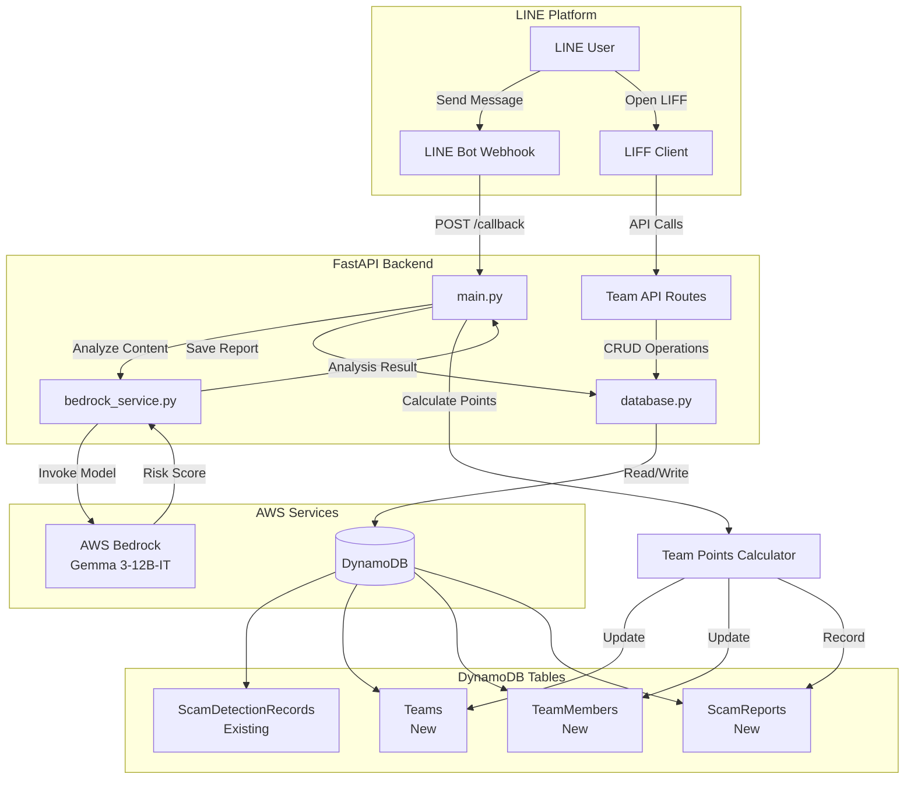
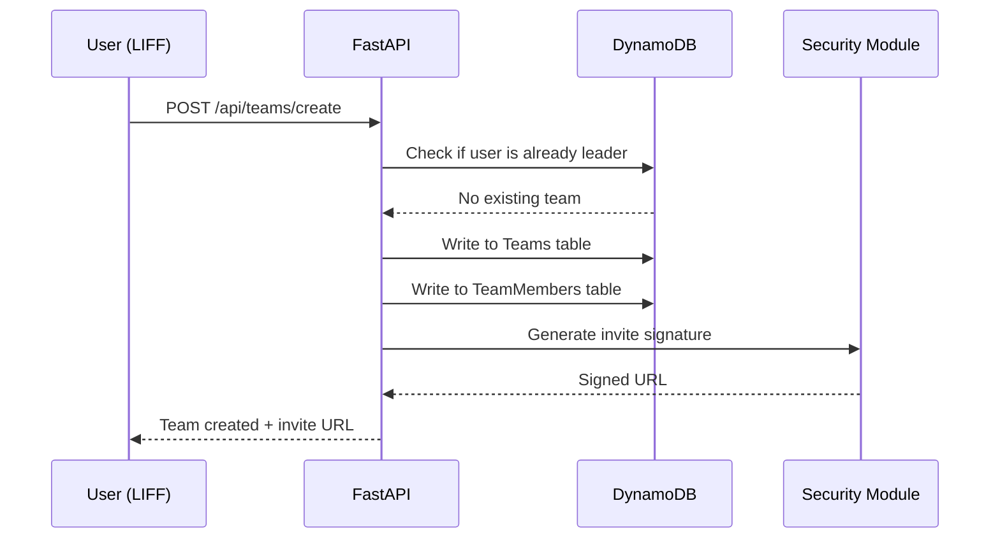
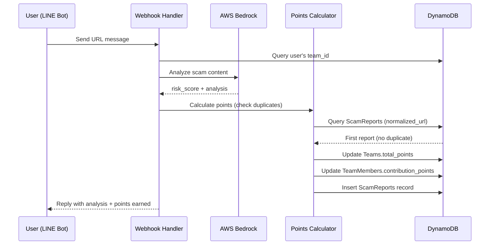

# Team Collaboration System - Technical Design Document

## Overview

團隊協作系統是 FLAC Linebot 詐騙偵測系統的社交擴充功能，透過 LINE LIFF 介面讓使用者建立團隊、邀請好友，並將個人詐騙通報行為轉化為團隊競賽機制。系統整合現有的 AWS Bedrock AI 詐騙偵測能力，實現團隊積分累積、排行榜展示與成員貢獻度統計。

### Key Design Goals

1. **無縫整合現有系統**：在不破壞現有 FastAPI + DynamoDB + Bedrock 架構的前提下，擴充團隊協作功能
2. **安全性優先**：使用 HMAC-SHA256 簽章機制防止邀請連結偽造與洗分行為
3. **高效查詢設計**：透過 DynamoDB GSI 優化團隊排行榜與成員貢獻度查詢
4. **原子性積分計算**：確保多人同時通報時的積分計算正確性
5. **可擴展性**：支援未來新增更多團隊任務與獎勵機制

### Integration Points with Existing System

- **FastAPI Routes** (`main.py`)：新增 `/api/teams/*` 端點處理團隊 CRUD 操作
- **DynamoDB Operations** (`database.py`)：擴充資料庫操作函數，新增 3 個資料表
- **Bedrock Service** (`bedrock_service.py`)：在詐騙分析完成後觸發團隊積分計算
- **Pydantic Models** (`models.py`)：新增 Team、TeamMember、ScamReport 資料模型
- **LIFF Frontend**：新增團隊管理頁面 (`team.html`)，整合 ShareTargetPicker API

## Architecture

### System Architecture Diagram



### Component Interaction Flow

**Team Creation Flow:**


**Scam Report with Team Points Flow:**


## Components and Interfaces

### Backend Components

#### 1. Team Management Module (`team_service.py`)

新增模組負責團隊相關業務邏輯：

```python
# team_service.py
from typing import Optional, List
from models import Team, TeamMember, CreateTeamRequest
from database import get_teams_table, get_team_members_table
import uuid
from datetime import datetime

class TeamService:
    def create_team(self, leader_uid: str, team_name: str) -> Team:
        """建立新團隊"""
        # 檢查使用者是否已是隊長
        # 產生 team_id (UUID)
        # 寫入 Teams table
        # 寫入 TeamMembers table (leader as first member)
        pass
    
    def invite_member(self, team_id: str, inviter_uid: str) -> str:
        """產生邀請連結（含 HMAC 簽章）"""
        pass
    
    def join_team(self, team_id: str, member_uid: str, signature: str) -> bool:
        """加入團隊（驗證簽章）"""
        pass
    
    def get_team_info(self, team_id: str) -> Optional[Team]:
        """取得團隊資訊"""
        pass
    
    def get_team_members(self, team_id: str) -> List[TeamMember]:
        """取得團隊成員清單"""
        pass
```

#### 2. Points Calculator Module (`points_calculator.py`)

負責積分計算與重複檢測：

```python
# points_calculator.py
from typing import Dict
from database import get_scam_reports_table, get_teams_table, get_team_members_table
from urllib.parse import urlparse
import re

class PointsCalculator:
    def normalize_url(self, url: str) -> str:
        """標準化 URL（移除 query params 與 trailing slash）"""
        parsed = urlparse(url)
        normalized = f"{parsed.scheme}://{parsed.netloc}{parsed.path.rstrip('/')}"
        return normalized.lower()
    
    def check_duplicate(self, normalized_url: str) -> bool:
        """檢查 URL 是否已被通報"""
        pass
    
    def calculate_points(self, risk_score: int) -> int:
        """計算積分（含倍數獎勵）"""
        if risk_score >= 9:
            return risk_score * 2  # 極高風險倍數獎勵
        return risk_score
    
    def update_team_points(self, team_id: str, member_uid: str, 
                          url: str, risk_score: int) -> Dict:
        """更新團隊與成員積分"""
        # 1. 標準化 URL
        # 2. 檢查重複
        # 3. 計算積分
        # 4. 更新 Teams.total_points
        # 5. 更新 TeamMembers.contribution_points
        # 6. 寫入 ScamReports
        pass
```

#### 3. Security Module (`security.py`)

HMAC 簽章與驗證：

```python
# security.py
import hmac
import hashlib
import os

class SecurityService:
    def __init__(self):
        self.secret_key = os.getenv("TEAM_INVITE_SECRET_KEY")
        if not self.secret_key:
            raise ValueError("TEAM_INVITE_SECRET_KEY not set in environment")
    
    def generate_signature(self, team_id: str) -> str:
        """產生 HMAC-SHA256 簽章"""
        message = team_id.encode('utf-8')
        signature = hmac.new(
            self.secret_key.encode('utf-8'),
            message,
            hashlib.sha256
        ).hexdigest()
        return signature
    
    def verify_signature(self, team_id: str, signature: str) -> bool:
        """驗證簽章"""
        expected_signature = self.generate_signature(team_id)
        return hmac.compare_digest(expected_signature, signature)
```

### API Endpoints

#### Team Management APIs

```python
# main.py 新增路由

@app.post("/api/teams/create")
async def create_team(request: CreateTeamRequest):
    """建立團隊
    
    Request Body:
    {
        "leader_uid": "U1234567890",
        "team_name": "防詐先鋒隊"
    }
    
    Response:
    {
        "team_id": "550e8400-e29b-41d4-a716-446655440000",
        "team_name": "防詐先鋒隊",
        "invite_url": "https://liff.line.me/xxx?team_id=xxx&signature=xxx"
    }
    """
    pass

@app.post("/api/teams/join")
async def join_team(request: JoinTeamRequest):
    """加入團隊
    
    Request Body:
    {
        "team_id": "550e8400-e29b-41d4-a716-446655440000",
        "member_uid": "U9876543210",
        "signature": "abc123..."
    }
    
    Response:
    {
        "success": true,
        "team_name": "防詐先鋒隊",
        "member_count": 5
    }
    """
    pass

@app.get("/api/teams/{team_id}")
async def get_team(team_id: str):
    """取得團隊資訊
    
    Response:
    {
        "team_id": "550e8400-e29b-41d4-a716-446655440000",
        "team_name": "防詐先鋒隊",
        "leader_uid": "U1234567890",
        "total_points": 1250,
        "member_count": 5,
        "created_at": "2024-01-15T10:30:00Z"
    }
    """
    pass

@app.get("/api/teams/{team_id}/members")
async def get_team_members(team_id: str):
    """取得團隊成員清單
    
    Response:
    {
        "members": [
            {
                "line_uid": "U1234567890",
                "display_name": "Alice",
                "contribution_points": 450,
                "report_count": 15,
                "is_leader": true,
                "joined_at": "2024-01-15T10:30:00Z"
            }
        ]
    }
    """
    pass

@app.get("/api/leaderboard/teams")
async def get_team_leaderboard():
    """取得團隊排行榜
    
    Response:
    {
        "teams": [
            {
                "rank": 1,
                "team_id": "550e8400-e29b-41d4-a716-446655440000",
                "team_name": "防詐先鋒隊",
                "total_points": 2500,
                "report_count": 85,
                "member_count": 8
            }
        ]
    }
    """
    pass
```

### Frontend Components (LIFF)

#### Team Management Page (`static/team.html`)

```html
<!DOCTYPE html>
<html>
<head>
    <title>團隊管理 - FLAC 防詐系統</title>
    <script src="https://static.line-scdn.net/liff/edge/2/sdk.js"></script>
    <script src="https://cdn.tailwindcss.com"></script>
</head>
<body>
    <div id="app">
        <!-- 建立團隊表單 -->
        <div id="create-team-section">
            <input id="team-name" placeholder="輸入團隊名稱" />
            <button onclick="createTeam()">建立團隊</button>
        </div>
        
        <!-- 團隊資訊 -->
        <div id="team-info-section" style="display:none;">
            <h2 id="team-name-display"></h2>
            <p>總積分：<span id="total-points"></span></p>
            <button onclick="inviteMembers()">邀請隊員</button>
        </div>
        
        <!-- 成員清單 -->
        <div id="members-list"></div>
    </div>
    
    <script src="team.js"></script>
</body>
</html>
```

#### Team JavaScript Module (`static/team.js`)

```javascript
// team.js
let liffId = 'YOUR_LIFF_ID';
let userId = null;

async function initializeLiff() {
    await liff.init({ liffId: liffId });
    if (!liff.isLoggedIn()) {
        liff.login();
    }
    const profile = await liff.getProfile();
    userId = profile.userId;
    loadTeamInfo();
}

async function createTeam() {
    const teamName = document.getElementById('team-name').value;
    const response = await fetch('/api/teams/create', {
        method: 'POST',
        headers: { 'Content-Type': 'application/json' },
        body: JSON.stringify({
            leader_uid: userId,
            team_name: teamName
        })
    });
    const data = await response.json();
    if (data.team_id) {
        alert('團隊建立成功！');
        loadTeamInfo();
    }
}

async function inviteMembers() {
    const teamId = getCurrentTeamId();
    const inviteUrl = await generateInviteUrl(teamId);
    
    // 使用 ShareTargetPicker 發送邀請
    if (liff.isApiAvailable('shareTargetPicker')) {
        const result = await liff.shareTargetPicker([
            {
                type: 'flex',
                altText: '加入我的防詐團隊！',
                contents: createInviteFlexMessage(teamId, inviteUrl)
            }
        ]);
        if (result) {
            alert('邀請已發送！');
        }
    }
}

function createInviteFlexMessage(teamId, inviteUrl) {
    return {
        type: 'bubble',
        hero: {
            type: 'image',
            url: 'https://your-domain.com/team-invite-banner.png',
            size: 'full',
            aspectRatio: '20:13'
        },
        body: {
            type: 'box',
            layout: 'vertical',
            contents: [
                {
                    type: 'text',
                    text: '🛡️ 加入防詐團隊',
                    weight: 'bold',
                    size: 'xl'
                },
                {
                    type: 'text',
                    text: '一起守護親友，累積團隊積分！',
                    size: 'sm',
                    color: '#999999',
                    margin: 'md'
                }
            ]
        },
        footer: {
            type: 'box',
            layout: 'vertical',
            contents: [
                {
                    type: 'button',
                    action: {
                        type: 'uri',
                        label: '立即加入',
                        uri: inviteUrl
                    },
                    style: 'primary'
                }
            ]
        }
    };
}

initializeLiff();
```

## Data Models

### DynamoDB Table Schemas

#### 1. Teams Table

**Table Name:** `Teams`

**Primary Key:**
- `team_id` (String, Partition Key) - UUID format

**Attributes:**
- `team_name` (String) - 團隊名稱 (1-30 字元)
- `leader_uid` (String) - 隊長的 LINE UID
- `total_points` (Number) - 團隊總積分
- `created_at` (String) - ISO 8601 timestamp
- `completed_quests` (List) - 已完成的任務 ID 列表
- `member_count` (Number) - 成員數量（冗餘欄位，加速查詢）

**GSI:** None (主要透過 Scan 取得排行榜，可考慮未來新增 GSI 優化)

**Example Item:**
```json
{
    "team_id": "550e8400-e29b-41d4-a716-446655440000",
    "team_name": "防詐先鋒隊",
    "leader_uid": "U1234567890",
    "total_points": 1250,
    "member_count": 5,
    "created_at": "2024-01-15T10:30:00Z",
    "completed_quests": ["daily_5_reports"]
}
```

#### 2. TeamMembers Table

**Table Name:** `TeamMembers`

**Primary Key:**
- `member_id` (String, Partition Key) - Format: `{team_id}#{line_uid}`

**Attributes:**
- `team_id` (String) - 所屬團隊 ID
- `line_uid` (String) - 成員的 LINE UID
- `contribution_points` (Number) - 個人貢獻積分
- `report_count` (Number) - 通報次數
- `joined_at` (String) - ISO 8601 timestamp
- `is_leader` (Boolean) - 是否為隊長

**GSI 1: TeamIdIndex**
- Partition Key: `team_id`
- Sort Key: `contribution_points` (降序)
- Projection: ALL
- Purpose: 查詢團隊所有成員並按貢獻度排序

**GSI 2: LineUidIndex**
- Partition Key: `line_uid`
- Projection: ALL
- Purpose: 查詢使用者所屬團隊

**Example Item:**
```json
{
    "member_id": "550e8400-e29b-41d4-a716-446655440000#U1234567890",
    "team_id": "550e8400-e29b-41d4-a716-446655440000",
    "line_uid": "U1234567890",
    "contribution_points": 450,
    "report_count": 15,
    "joined_at": "2024-01-15T10:30:00Z",
    "is_leader": true
}
```

#### 3. ScamReports Table

**Table Name:** `ScamReports`

**Primary Key:**
- `report_id` (String, Partition Key) - Format: `{line_uid}#{timestamp}`

**Attributes:**
- `url` (String) - 原始通報 URL
- `normalized_url` (String) - 標準化後的 URL
- `reporter_uid` (String) - 通報者 LINE UID
- `team_id` (String) - 所屬團隊 ID (可為空)
- `risk_score` (Number) - Bedrock AI 評分 (1-10)
- `category` (String) - 詐騙類別
- `multiplier_applied` (Boolean) - 是否套用倍數獎勵
- `points_earned` (Number) - 實際獲得積分
- `reported_at` (String) - ISO 8601 timestamp

**GSI 1: NormalizedUrlIndex**
- Partition Key: `normalized_url`
- Projection: KEYS_ONLY
- Purpose: 快速檢測重複通報

**GSI 2: TeamIdIndex**
- Partition Key: `team_id`
- Sort Key: `reported_at` (降序)
- Projection: ALL
- Purpose: 查詢團隊通報歷史

**Example Item:**
```json
{
    "report_id": "U1234567890#2024-01-15T14:25:30Z",
    "url": "https://scam-site.com/fake-investment?ref=123",
    "normalized_url": "https://scam-site.com/fake-investment",
    "reporter_uid": "U1234567890",
    "team_id": "550e8400-e29b-41d4-a716-446655440000",
    "risk_score": 9,
    "category": "假投資詐騙",
    "multiplier_applied": true,
    "points_earned": 18,
    "reported_at": "2024-01-15T14:25:30Z"
}
```

### Pydantic Models

```python
# models.py 新增

from pydantic import BaseModel, Field
from typing import Optional, List
from datetime import datetime

class Team(BaseModel):
    team_id: str
    team_name: str = Field(..., min_length=1, max_length=30)
    leader_uid: str
    total_points: int = 0
    member_count: int = 1
    created_at: datetime
    completed_quests: List[str] = []

class TeamMember(BaseModel):
    member_id: str
    team_id: str
    line_uid: str
    contribution_points: int = 0
    report_count: int = 0
    joined_at: datetime
    is_leader: bool = False

class ScamReport(BaseModel):
    report_id: str
    url: str
    normalized_url: str
    reporter_uid: str
    team_id: Optional[str] = None
    risk_score: int = Field(..., ge=0, le=10)
    category: str
    multiplier_applied: bool = False
    points_earned: int
    reported_at: datetime

class CreateTeamRequest(BaseModel):
    leader_uid: str
    team_name: str = Field(..., min_length=1, max_length=30)

class JoinTeamRequest(BaseModel):
    team_id: str
    member_uid: str
    signature: str

class TeamLeaderboard(BaseModel):
    rank: int
    team_id: str
    team_name: str
    total_points: int
    report_count: int
    member_count: int
```


## Correctness Properties

*A property is a characteristic or behavior that should hold true across all valid executions of a system-essentially, a formal statement about what the system should do. Properties serve as the bridge between human-readable specifications and machine-verifiable correctness guarantees.*

### Property 1: Team ID Uniqueness

*For any* valid team name (1-30 characters), when creating a team, the system should generate a unique Team_ID in UUID format that does not collide with existing team IDs.

**Validates: Requirements 1.2**

### Property 2: Team Creation Completeness

*For any* user creating a team with a valid name, the resulting Teams table record should contain all required fields: team_id, team_name, leader_uid (set to creator's LINE_UID), created_at timestamp, and initial total_points of 0.

**Validates: Requirements 1.3, 1.4**

### Property 3: Team Name Validation

*For any* team name that is empty or exceeds 30 characters, the system should reject the creation request and return a validation error.

**Validates: Requirements 1.7**

### Property 4: Invite URL Generation

*For any* team, when generating an invite URL, the URL should contain the team_id parameter and a valid HMAC-SHA256 signature.

**Validates: Requirements 2.3**

### Property 5: Flex Message Completeness

*For any* team invite, the generated Flex Message should contain all required information: team name, leader display name, current member count, and a join button with the invite URL.

**Validates: Requirements 2.4**

### Property 6: URL Parameter Parsing

*For any* LIFF URL containing a team_id parameter, the system should correctly extract the team_id value.

**Validates: Requirements 3.1**

### Property 7: Team Join Completeness

*For any* user joining a team, the system should create a TeamMembers table record with member_id (format: team_id#line_uid), team_id, line_uid, joined_at timestamp, and initial contribution_points of 0.

**Validates: Requirements 3.5, 3.6**

### Property 8: First Reporter Points Award

*For any* URL that has not been previously reported, when a team member reports it, the system should add the risk_score to both the team's total_points and the member's contribution_points, and create a ScamReports record.

**Validates: Requirements 4.4, 4.5, 4.6**

### Property 9: Duplicate Report Rejection

*For any* URL that already exists in ScamReports (based on normalized_url), subsequent reports should not increase any team or member points.

**Validates: Requirements 4.7, 11.3**

### Property 10: High Risk Multiplier

*For any* scam report with risk_score >= 9, the system should apply a 2x multiplier to the points awarded, set multiplier_applied to true in the ScamReports record, and award points_earned = risk_score * 2.

**Validates: Requirements 5.1, 5.2, 5.3, 5.4, 5.5**

### Property 11: Team Leaderboard Ordering

*For any* list of teams, the leaderboard should be sorted in descending order by total_points, with the highest-scoring team ranked first.

**Validates: Requirements 6.2**

### Property 12: Member Contribution Ordering

*For any* team's member list, members should be sorted in descending order by contribution_points, with the highest contributor ranked first.

**Validates: Requirements 6.6, 7.4**

### Property 13: Daily Quest Completion

*For any* team that accumulates exactly 5 valid reports within a single day, the system should award 50 bonus points, add "daily_5_reports" to completed_quests, and not award the bonus again if already completed.

**Validates: Requirements 8.2, 8.3, 8.4, 8.6**

### Property 14: Domain Extraction

*For any* URL, the system should correctly extract the domain name (e.g., "scam-site.com" from "https://scam-site.com/path?query=123").

**Validates: Requirements 9.2**

### Property 15: Domain Trend Ordering

*For any* list of reported domains, the trend map should be sorted in descending order by report count, with the most frequently reported domain ranked first.

**Validates: Requirements 9.5**

### Property 16: HMAC Signature Round-Trip

*For any* team_id, generating a signature and then verifying it with the same team_id should return true (signature validation succeeds).

**Validates: Requirements 10.1, 10.3**

### Property 17: URL Normalization Idempotence

*For any* URL, normalizing it multiple times should produce the same result (normalize(normalize(url)) == normalize(url)), where normalization removes query parameters and trailing slashes.

**Validates: Requirements 11.2**


## Error Handling

### Input Validation Errors

**Team Name Validation:**
- Empty team name → HTTP 400 with message: "團隊名稱不可為空"
- Team name > 30 characters → HTTP 400 with message: "團隊名稱不可超過 30 字元"
- Team name contains only whitespace → HTTP 400 with message: "團隊名稱不可為空白字元"

**Duplicate Team Leader:**
- User already leads a team → HTTP 409 with message: "您已經是隊長，無法建立多個團隊"

**Invalid Team Join:**
- Team does not exist → HTTP 404 with message: "團隊不存在或已解散"
- User already in the team → HTTP 409 with message: "您已經是團隊成員"
- User already in another team → HTTP 409 with message: "您已加入其他團隊，請先退出"
- Invalid signature → HTTP 403 with message: "無效的邀請連結"

### Security Errors

**HMAC Signature Verification:**
- Missing signature parameter → HTTP 400 with message: "缺少簽章參數"
- Signature mismatch → HTTP 403 with message: "簽章驗證失敗，邀請連結可能已過期或被竄改"
- Missing TEAM_INVITE_SECRET_KEY environment variable → Server startup failure with error log

### Database Errors

**DynamoDB Operation Failures:**
- Table does not exist → Auto-create tables on startup (see database.py pattern)
- Write capacity exceeded → HTTP 503 with message: "系統繁忙，請稍後再試"
- Read timeout → HTTP 504 with message: "查詢逾時，請重新整理"
- Conditional check failed (race condition) → Retry with exponential backoff (max 3 attempts)

**Data Consistency:**
- Team member count mismatch → Background job to reconcile counts daily
- Points calculation race condition → Use DynamoDB atomic counters (UpdateExpression with ADD)

### External Service Errors

**AWS Bedrock Failures:**
- Model invocation timeout → Fallback to default risk_score of 5, log error
- Invalid response format → Parse with error handling, use default values
- Rate limit exceeded → Queue report for retry (max 3 attempts with exponential backoff)

**LINE API Failures:**
- ShareTargetPicker not available → Display error: "您的 LINE 版本不支援此功能，請更新至最新版本"
- LIFF initialization failed → Redirect to error page with retry button
- Profile fetch failed → Use LINE_UID as display name fallback

### Graceful Degradation

**Leaderboard Query Performance:**
- If Teams table scan takes > 5 seconds → Return cached results (TTL: 5 minutes)
- If member count > 1000 → Paginate results (limit: 100 per page)

**Report Processing:**
- If team lookup fails → Process report without team association (individual points only)
- If points update fails → Log error, queue for retry, but still save report record

## Testing Strategy

### Dual Testing Approach

This feature requires both unit tests and property-based tests to ensure comprehensive coverage:

**Unit Tests** focus on:
- Specific examples of team creation, joining, and reporting
- Edge cases (empty names, duplicate leaders, invalid signatures)
- Error conditions (missing teams, database failures)
- Integration points with LINE API and AWS Bedrock

**Property-Based Tests** focus on:
- Universal properties that hold for all inputs (see Correctness Properties section)
- Comprehensive input coverage through randomization
- Invariants that must be maintained across operations

### Property-Based Testing Configuration

**Library Selection:**
- Python: Use `hypothesis` library for property-based testing
- Minimum 100 iterations per property test (due to randomization)
- Each test must reference its design document property using tags

**Test Tag Format:**
```python
@pytest.mark.property
@pytest.mark.feature("team-collaboration")
@pytest.mark.validates("Property 1: Team ID Uniqueness")
def test_team_id_uniqueness():
    """Property 1: For any valid team name, generated Team_ID should be unique"""
    pass
```

### Unit Test Coverage

**Team Management:**
- `test_create_team_success()` - Valid team creation
- `test_create_team_duplicate_leader()` - Reject duplicate leader
- `test_create_team_invalid_name()` - Reject empty/long names
- `test_join_team_success()` - Valid team join
- `test_join_team_invalid_signature()` - Reject invalid signature
- `test_join_team_already_member()` - Reject duplicate join
- `test_join_team_other_team_member()` - Reject cross-team join

**Points Calculation:**
- `test_first_report_awards_points()` - First report gets points
- `test_duplicate_report_no_points()` - Duplicate report rejected
- `test_high_risk_multiplier()` - risk_score >= 9 gets 2x points
- `test_url_normalization()` - URL normalization works correctly
- `test_atomic_points_update()` - Concurrent reports handled correctly

**Security:**
- `test_hmac_signature_generation()` - Signature generation
- `test_hmac_signature_verification()` - Signature verification
- `test_hmac_signature_tampering()` - Reject tampered signatures

**Leaderboard:**
- `test_team_leaderboard_ordering()` - Teams sorted by points
- `test_member_contribution_ordering()` - Members sorted by contribution
- `test_domain_trend_ordering()` - Domains sorted by report count

### Property-Based Test Examples

**Property 1: Team ID Uniqueness**
```python
from hypothesis import given, strategies as st

@given(team_name=st.text(min_size=1, max_size=30))
def test_team_id_uniqueness(team_name):
    """For any valid team name, generated Team_ID should be unique"""
    team_ids = set()
    for _ in range(10):
        team = create_team(leader_uid="U123", team_name=team_name)
        assert team.team_id not in team_ids
        team_ids.add(team.team_id)
```

**Property 9: Duplicate Report Rejection**
```python
@given(url=st.text(min_size=10, max_size=200))
def test_duplicate_report_rejection(url):
    """For any URL, second report should not award points"""
    # First report
    result1 = report_scam(url=url, reporter_uid="U1", team_id="T1", risk_score=7)
    assert result1.points_earned == 7
    
    # Second report (duplicate)
    result2 = report_scam(url=url, reporter_uid="U2", team_id="T2", risk_score=8)
    assert result2.points_earned == 0
    assert result2.is_duplicate == True
```

**Property 17: URL Normalization Idempotence**
```python
@given(url=st.from_regex(r'https?://[a-z]+\.[a-z]+/[a-z]*\??.*', fullmatch=True))
def test_url_normalization_idempotence(url):
    """For any URL, normalize(normalize(url)) == normalize(url)"""
    normalized_once = normalize_url(url)
    normalized_twice = normalize_url(normalized_once)
    assert normalized_once == normalized_twice
```

### Integration Testing

**LINE LIFF Integration:**
- Mock LIFF SDK for unit tests
- Use LINE LIFF Simulator for manual testing
- Test ShareTargetPicker flow end-to-end

**AWS Services Integration:**
- Use moto library to mock DynamoDB in tests
- Use boto3 stubber to mock Bedrock responses
- Test actual AWS integration in staging environment

**End-to-End Scenarios:**
1. User creates team → invites friend → friend joins → both report scams → check leaderboard
2. Multiple teams report same URL → verify only first team gets points
3. Team completes daily quest → verify bonus points awarded
4. High-risk report → verify 2x multiplier applied

### Performance Testing

**Load Testing Targets:**
- Team creation: < 500ms response time
- Report processing: < 1000ms (including Bedrock AI call)
- Leaderboard query: < 2000ms (with 1000 teams)
- Concurrent reports: Handle 10 simultaneous reports without race conditions

**Stress Testing:**
- 100 teams with 50 members each
- 10,000 scam reports
- 1,000 concurrent API requests

### Test Data Management

**Fixtures:**
- `sample_teams.json` - 10 pre-configured teams
- `sample_members.json` - 50 pre-configured members
- `sample_reports.json` - 100 pre-configured scam reports

**Database Seeding:**
```python
# tests/conftest.py
@pytest.fixture
def seed_test_data():
    """Seed DynamoDB with test data"""
    create_test_teams(count=10)
    create_test_members(count=50)
    create_test_reports(count=100)
    yield
    cleanup_test_data()
```

### Continuous Integration

**GitHub Actions Workflow:**
```yaml
name: Team Collaboration Tests

on: [push, pull_request]

jobs:
  test:
    runs-on: ubuntu-latest
    steps:
      - uses: actions/checkout@v2
      - name: Set up Python
        uses: actions/setup-python@v2
        with:
          python-version: '3.9'
      - name: Install dependencies
        run: |
          pip install -r requirements.txt
          pip install pytest hypothesis moto
      - name: Run unit tests
        run: pytest tests/unit/ -v
      - name: Run property tests
        run: pytest tests/property/ -v --hypothesis-show-statistics
      - name: Run integration tests
        run: pytest tests/integration/ -v
```

## Implementation Notes

### Database Migration Strategy

Since this is a new feature, we need to create 3 new DynamoDB tables. Follow the existing pattern in `database.py`:

```python
# database.py additions

def create_team_tables_if_not_exist():
    """Create Teams, TeamMembers, and ScamReports tables"""
    tables_to_create = [
        {
            'name': 'Teams',
            'key_schema': [{'AttributeName': 'team_id', 'KeyType': 'HASH'}],
            'attribute_definitions': [{'AttributeName': 'team_id', 'AttributeType': 'S'}],
            'gsi': []
        },
        {
            'name': 'TeamMembers',
            'key_schema': [{'AttributeName': 'member_id', 'KeyType': 'HASH'}],
            'attribute_definitions': [
                {'AttributeName': 'member_id', 'AttributeType': 'S'},
                {'AttributeName': 'team_id', 'AttributeType': 'S'},
                {'AttributeName': 'line_uid', 'AttributeType': 'S'},
                {'AttributeName': 'contribution_points', 'AttributeType': 'N'}
            ],
            'gsi': [
                {
                    'IndexName': 'TeamIdIndex',
                    'KeySchema': [
                        {'AttributeName': 'team_id', 'KeyType': 'HASH'},
                        {'AttributeName': 'contribution_points', 'KeyType': 'RANGE'}
                    ]
                },
                {
                    'IndexName': 'LineUidIndex',
                    'KeySchema': [{'AttributeName': 'line_uid', 'KeyType': 'HASH'}]
                }
            ]
        },
        {
            'name': 'ScamReports',
            'key_schema': [{'AttributeName': 'report_id', 'KeyType': 'HASH'}],
            'attribute_definitions': [
                {'AttributeName': 'report_id', 'AttributeType': 'S'},
                {'AttributeName': 'normalized_url', 'AttributeType': 'S'},
                {'AttributeName': 'team_id', 'AttributeType': 'S'},
                {'AttributeName': 'reported_at', 'AttributeType': 'S'}
            ],
            'gsi': [
                {
                    'IndexName': 'NormalizedUrlIndex',
                    'KeySchema': [{'AttributeName': 'normalized_url', 'KeyType': 'HASH'}]
                },
                {
                    'IndexName': 'TeamIdIndex',
                    'KeySchema': [
                        {'AttributeName': 'team_id', 'KeyType': 'HASH'},
                        {'AttributeName': 'reported_at', 'KeyType': 'RANGE'}
                    ]
                }
            ]
        }
    ]
    
    for table_config in tables_to_create:
        create_table_if_not_exists(table_config)
```

### Integration with Existing Webhook Handler

Modify `main.py` webhook handler to integrate team points calculation:

```python
# main.py modifications

@handler.add(MessageEvent, message=TextMessageContent)
def handle_text(event):
    """處理文字訊息（整合團隊積分）"""
    user_text = event.message.text
    user_id = event.source.user_id
    
    # 偵測網址
    urls = re.findall(r'https?://[^\s]+', user_text)
    
    # 使用 Bedrock 分析詐騙風險
    analysis_result = analyze_scam_content(user_text)
    
    # 儲存到資料庫（現有邏輯）
    record = ScamDetectionRecord(
        user_id=user_id,
        input_content=user_text,
        risk_score=analysis_result['risk_score'],
        category=analysis_result['category'],
        analysis=analysis_result['analysis'],
        expert_warning=analysis_result['expert_warning']
    )
    add_detection_record(record)
    
    # 新增：團隊積分計算
    if urls:
        team_result = update_team_points_for_report(
            reporter_uid=user_id,
            url=urls[0],  # 取第一個 URL
            risk_score=analysis_result['risk_score'],
            category=analysis_result['category']
        )
        
        # 修改回覆訊息，加入團隊積分資訊
        if team_result and team_result.get('points_earned', 0) > 0:
            reply_text = format_reply_with_team_points(analysis_result, team_result)
        else:
            reply_text = format_reply_message(analysis_result)
    else:
        reply_text = format_reply_message(analysis_result)
    
    reply_message(event.reply_token, reply_text)
```

### Environment Variables

Add to `.env` file:

```bash
# Team Collaboration Settings
TEAM_INVITE_SECRET_KEY=your-secret-key-here-min-32-chars
LIFF_ID_TEAM_MANAGEMENT=1234567890-abcdefgh
LIFF_ID_TEAM_JOIN=1234567890-ijklmnop
```

### Deployment Checklist

1. ✅ Create new DynamoDB tables (Teams, TeamMembers, ScamReports)
2. ✅ Deploy updated backend code with new API endpoints
3. ✅ Deploy new LIFF apps (team.html, team.js)
4. ✅ Configure LIFF IDs in LINE Developers Console
5. ✅ Set environment variables (TEAM_INVITE_SECRET_KEY, LIFF_IDs)
6. ✅ Run database migration script
7. ✅ Test HMAC signature generation/verification
8. ✅ Test ShareTargetPicker integration
9. ✅ Verify Bedrock AI integration still works
10. ✅ Monitor CloudWatch logs for errors

### Performance Optimization Considerations

**DynamoDB Query Optimization:**
- Use GSI for team member queries (avoid full table scans)
- Implement pagination for large result sets
- Cache leaderboard results (TTL: 5 minutes)

**Atomic Counter Updates:**
```python
# Use DynamoDB atomic counters for points
table.update_item(
    Key={'team_id': team_id},
    UpdateExpression='ADD total_points :points',
    ExpressionAttributeValues={':points': points_to_add}
)
```

**Batch Operations:**
- Use batch_write_item for bulk member additions
- Use batch_get_item for fetching multiple team details

### Security Considerations

**HMAC Secret Key Management:**
- Store in AWS Secrets Manager (production)
- Rotate key every 90 days
- Use different keys for dev/staging/production

**Input Sanitization:**
- Validate all user inputs (team names, URLs)
- Escape special characters in database queries
- Implement rate limiting on API endpoints (10 requests/minute per user)

**Authorization:**
- Verify user is team leader before allowing invites
- Verify signature before allowing team joins
- Implement CORS restrictions on API endpoints

